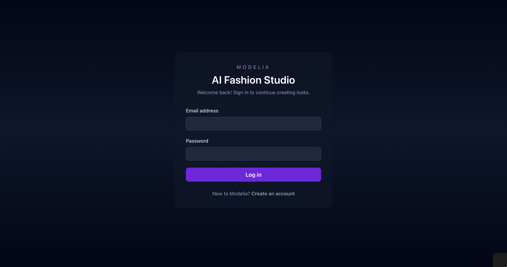
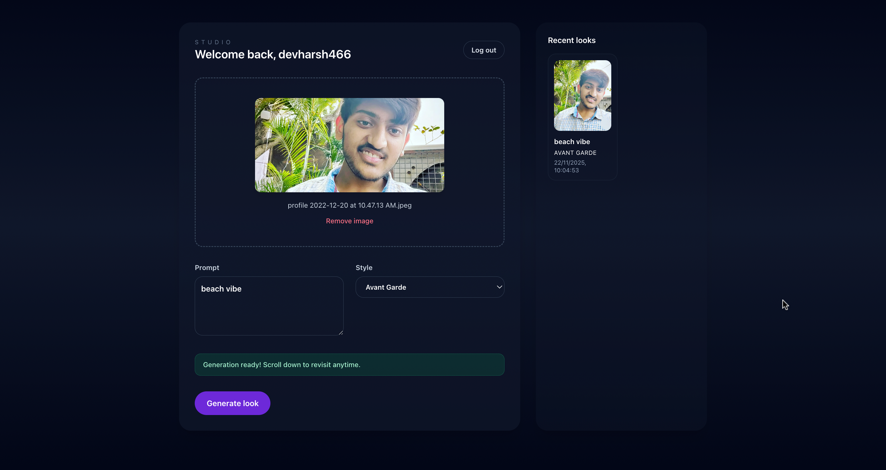

## Modelia AI Studio

A full-stack take-home project that simulates a fashion image generation studio. Users can sign up, log in, upload reference images, describe looks, handle simulated overload errors with retries/abort, and revisit the last five generations.

### Screenshots

**Login Screen**



The login interface allows users to sign in with their email and password, or create a new account.

**Main Studio Interface**



The main studio interface features:
- Image upload with preview
- Text prompt input for describing the desired look
- Style selection dropdown (Avant Garde, Cyberpunk, Minimal, etc.)
- Real-time generation status
- Recent generations history panel

### Tech Stack

- **Backend**: Node.js, Express, TypeScript, Prisma (SQLite), JWT auth, Multer uploads, Zod validation, Jest + Supertest.
- **Frontend**: React (Vite, TS, Tailwind), custom hooks for generation/retry, React Testing Library + Vitest.
- **E2E**: Playwright (Chromium) with shared dev servers spun up automatically.

### Prerequisites

- Node.js `>=20.19.0` (matches Prisma & Vite requirements)
- npm `>=10`

### Setup

```bash
git clone <repo>
cd Assignment_modelia
npm install
```

Copy the backend environment template and adjust secrets/paths as needed:

```bash
cp backend/env.example backend/.env
```

### Development

Run backend and frontend in separate terminals:

```bash
npm run dev:backend   # http://localhost:4000
npm run dev:frontend  # http://localhost:5173
```

### Testing & Quality

```bash
npm run lint          # shared ESLint config
npm run test:backend  # Jest + Supertest, includes Prisma test DB
npm run test:frontend # Vitest + RTL + happy-dom
npm run test:e2e      # Playwright (Chromium) – spins up dev servers automatically
npm run test          # Runs backend, frontend, then e2e with coverage
```

Coverage output lives in:

- `coverage/backend` (Jest)
- `frontend/coverage` (Vitest)

### OpenAPI

`OPENAPI.yaml` documents `/auth` and `/generations` endpoints (request/response schemas, auth, errors).

### CI

GitHub Actions workflow (`.github/workflows/ci.yml`) installs deps, lints, runs backend/frontend unit suites, executes Playwright, and uploads coverage artifacts.

### Project Notes

- Image uploads are stored on disk (`backend/uploads`) and served statically.
- Generations simulate 1–2s processing time with a 20% “Model overloaded” error to exercise retry/abort paths.
- Local sessions persist via `localStorage`; hooks keep UI + history in sync.
- `EVAL.md` and `AI_USAGE.md` capture checklist compliance and AI assist references per instructions.

